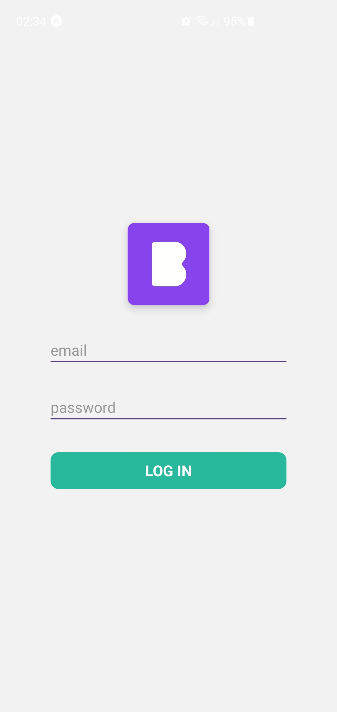
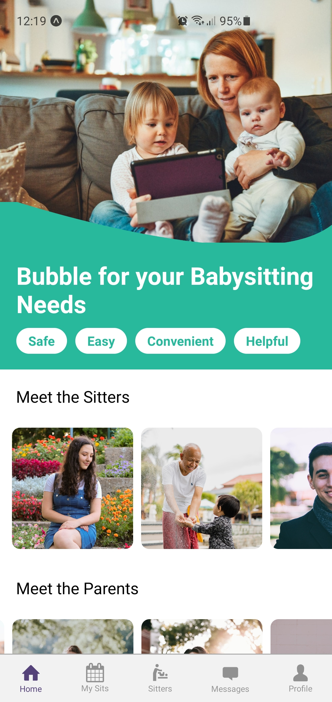
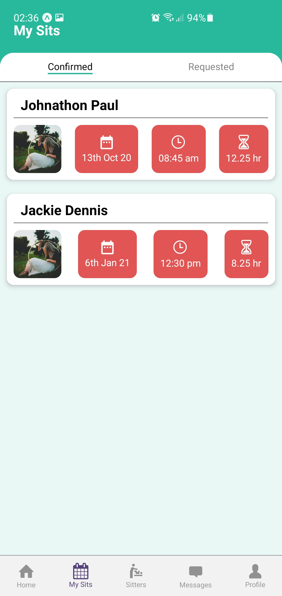
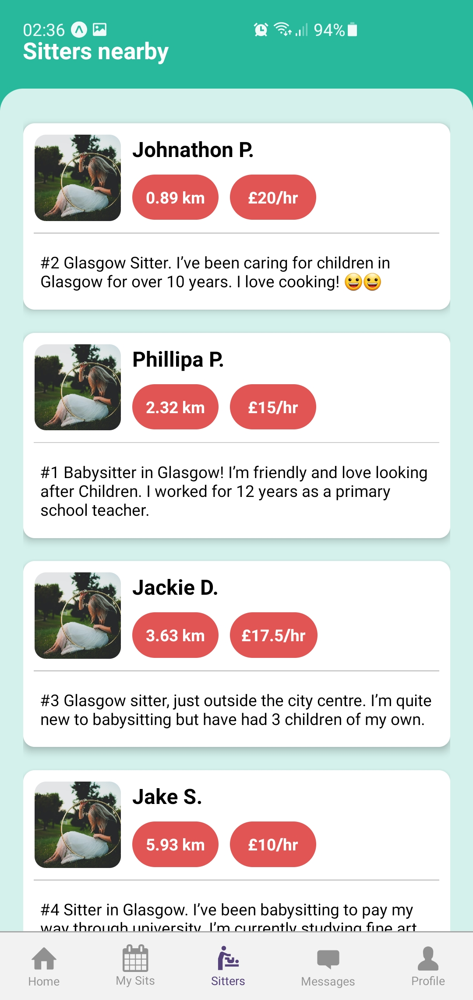
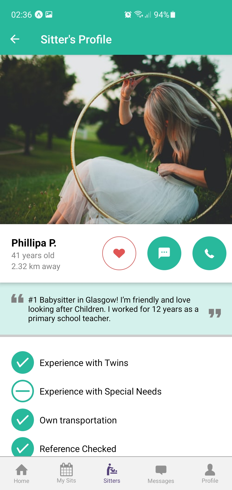
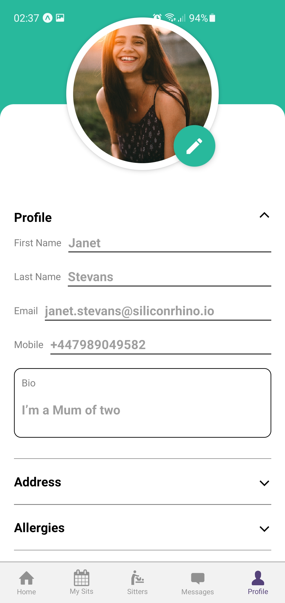

<h1>Bubble App</h1>

Welcome to Bubble App. One solution for all babysitting needs.

<h2>Screenshots</h2>

  
  
  
  
  
  

<h2>Getting started</h2>

Follow these instructions to build the app.

1. Navigate to `src` directory
2. Install all dependencies `yarn install`
3. Start the App `yarn start`
4. Launch the App on your `Device` or `Emulator/Simulator` using `Expo Go` App

> ### Important ###
> For testing purpose, please use following credentials.\
> Email: janet.stevans@siliconrhino.io\
> Password: 12345

